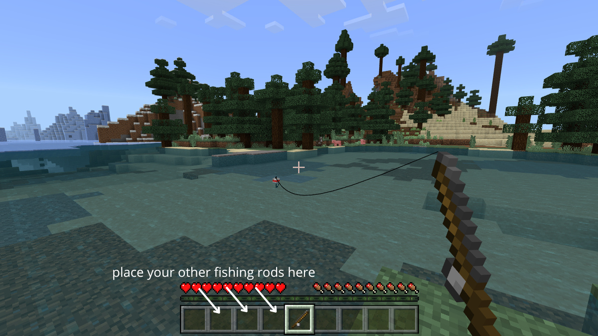

# fishing_bot_minecraft
A fishing bot which allows you to get all ressources from the sea in minecraft while you are AFK. Unlike automatic fishing farms, you can get enchanted bows, fishing rods, etc...

# REQUIREMENTS :

1) You just have to install the VB audio cable App. When you firstly launch the code, it should be installed automatically.

2) If you want, you can install it manually : from https://vb-audio.com/Cable/index.htm click on the link to download VBCABLE_Driver_Pack43.zip, and launch VBCABLE_SETUP.

3) In your sound manager, change the audio output to CABLE input.

4) Mute the sound of all software other than minecraft. In the MC sound settings, deactivate everything except the "friendly creatures" one.

5) Paste the following command "pip install sounddevice numpy threading time pynput requests" in your terminal.

# IN GAME :

1)Launch main.py and place your fishing rods directly on the left of the one you use first.

2)Find a quiet place where you can't be attacked by mobs.

3)Throw the fishing rod and go take a coffee, the bot is working !

